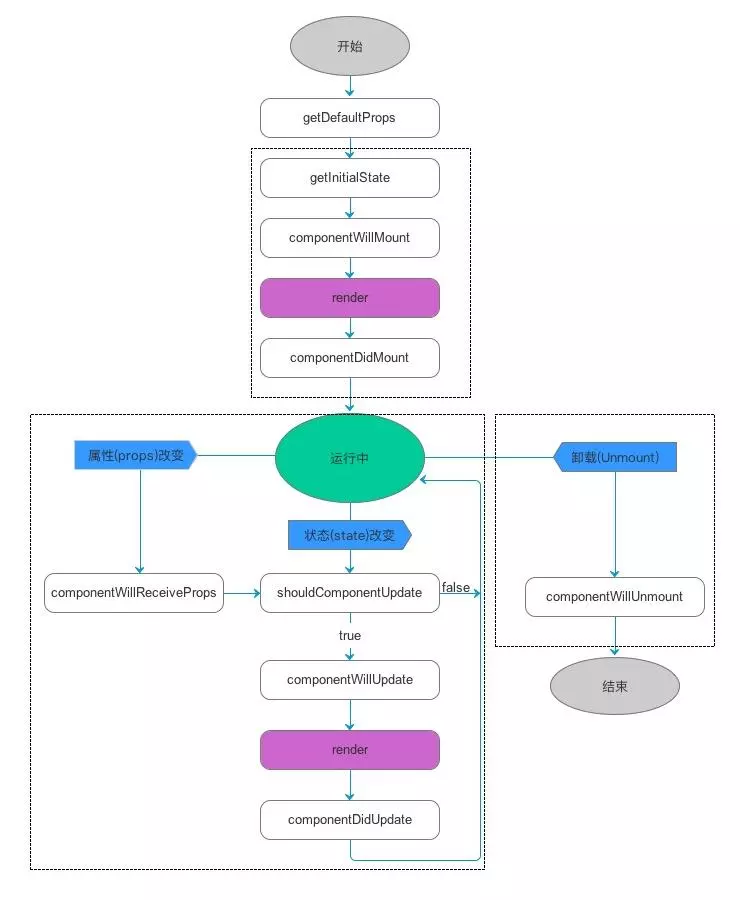

# React

## React 生命周期

| 生命周期                  | 参数                               | 调用次数        | 能否使用setState() |
|---------------------------|------------------------------------|-----------------|--------------------|
| getDefaultProps           | null                               | 1(全局调用一次) | 否                 |
| getInitialState           | null                               | 1               | 否                 |
| componentWillMount        | null                               | 1               | 是                 |
| render                    | null                               | >= 1            | 否                 |
| componentDidMount         | null                               | 1               | 是                 |
| componentWillReceiveProps | object nextProps                   | >= 0            | 是                 |
| shouldComponentUpdate     | object nextProps, object nextState | >= 0            | 否                 |
| componentWillUpdate       | object nextProps, object nextState | >= 0            | 否                 |
| componentDidUpdate        | object prevProps, object prevState | >= 0            | 否                 |
| componentWillUnmound      | null                               | 1               | 否                 |
