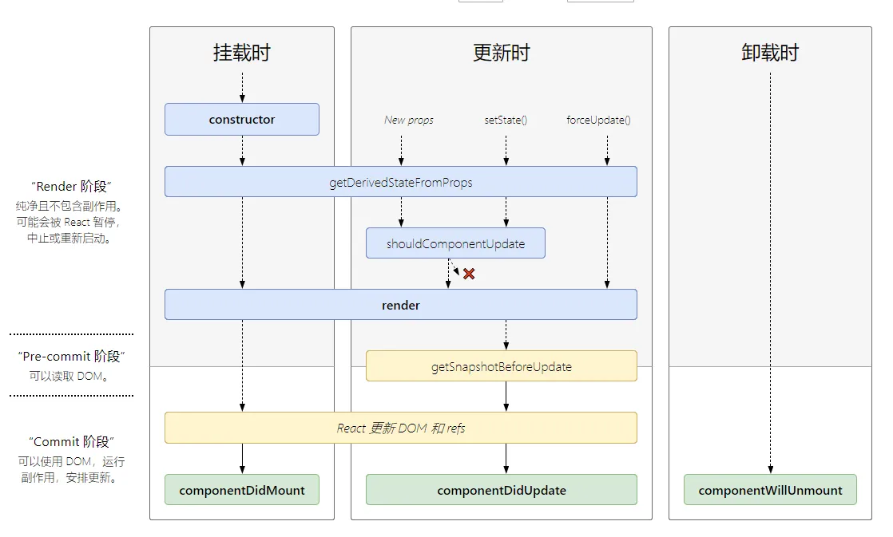

# React

## React 官方文档

<https://reactjs.org/>

## React 生命周期

| 生命周期                      | 参数                               | 调用次数        | 能否使用 setState() |
| ----------------------------- | ---------------------------------- | --------------- | ------------------- |
| getDefaultProps               | null                               | 1(全局调用一次) | 否                  |
| getInitialState               | null                               | 1               | 否                  |
| ~~componentWillMount~~        | null                               | 1               | 是                  |
| render                        | null                               | >= 1            | 否                  |
| componentDidMount             | null                               | 1               | 是                  |
| ~~componentWillReceiveProps~~ | object nextProps                   | >= 0            | 是                  |
| shouldComponentUpdate         | object nextProps, object nextState | >= 0            | 否                  |
| ~~componentWillUpdate~~       | object nextProps, object nextState | >= 0            | 否                  |
| componentDidUpdate            | object prevProps, object prevState | >= 0            | 否                  |
| componentWillUnmound          | null                               | 1               | 否                  |

React 生命周期图 16.4+: <http://projects.wojtekmaj.pl/react-lifecycle-methods-diagram/>

## Useful Links

- React 高频面试题 <https://mp.weixin.qq.com/s/3jmJgZFktP2NMT8XLvdIKQ>

## 知识点

### Component 类型选择

- Class Component: 需要使用 state，及完整的生命周期
- Function Component: 只使用 props 的简易实现
- Hooks: 用来支持 Function Component 使用 state

## 常用 React 工具

| 工具               | 说明                         | 官网                                               |
| ------------------ | ---------------------------- | -------------------------------------------------- |
| React Styleguidist | React 独立开发及文档生成工具 | https://github.com/styleguidist/react-styleguidist |
| Story Book         | React 独立开发及文档生成工具 | https://storybook.js.org/                          |

## React 中实现 Memoize(记忆化)

|                          |     |
| ------------------------ | --- |
| `componentShouldUdpdate` |实现该函数决定是否重新render|
| `React.memo`             |封装成高阶组件    |
| `useCallback`            |返回一个Memoize的函数|
| `useMemo`                |返回一个Memoize的值|

refs: <https://medium.com/@rossbulat/how-to-memoize-in-react-3d20cbcd2b6e>
