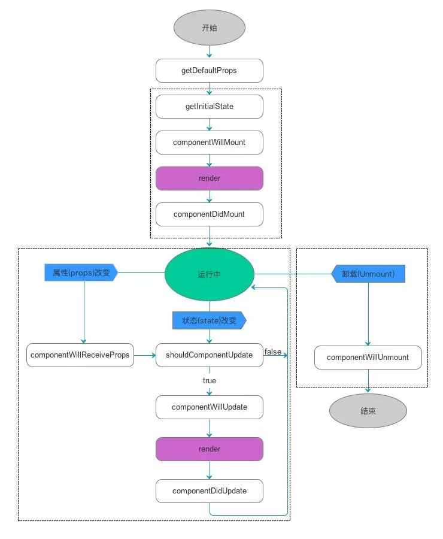
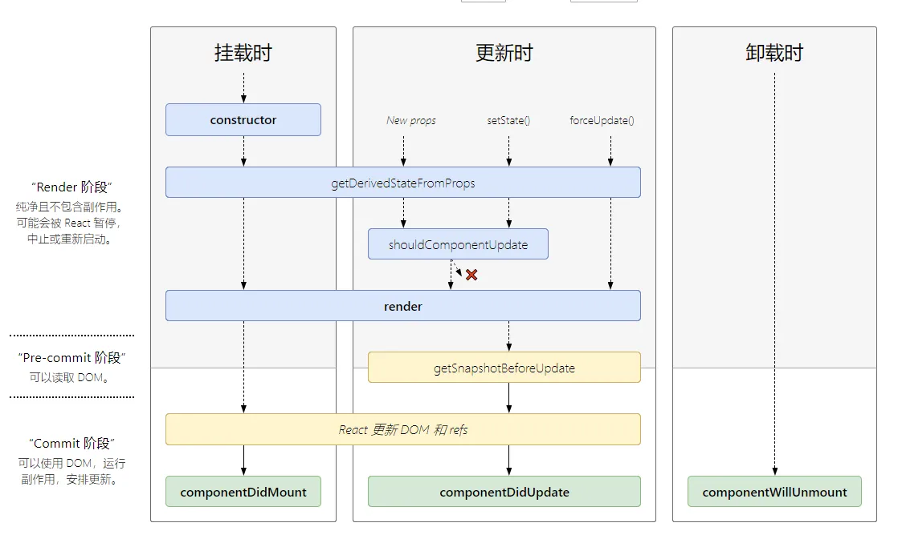

# React

## React 官方文档

<https://reactjs.org/>

## React 生命周期

| 生命周期                      | 参数                               | 调用次数        | 能否使用 setState() |
| ----------------------------- | ---------------------------------- | --------------- | ------------------- |
| getDefaultProps               | null                               | 1(全局调用一次) | 否                  |
| getInitialState               | null                               | 1               | 否                  |
| ~~componentWillMount~~        | null                               | 1               | 是                  |
| render                        | null                               | >= 1            | 否                  |
| componentDidMount             | null                               | 1               | 是                  |
| ~~componentWillReceiveProps~~ | object nextProps                   | >= 0            | 是                  |
| shouldComponentUpdate         | object nextProps, object nextState | >= 0            | 否                  |
| ~~componentWillUpdate~~       | object nextProps, object nextState | >= 0            | 否                  |
| componentDidUpdate            | object prevProps, object prevState | >= 0            | 否                  |
| componentWillUnmound          | null                               | 1               | 否                  |

React 生命周期图 16.4+: <http://projects.wojtekmaj.pl/react-lifecycle-methods-diagram/>

## Useful Links

- React 高频面试题 <https://mp.weixin.qq.com/s/3jmJgZFktP2NMT8XLvdIKQ>

## 知识点

### Component 类型选择

- Class Component: 需要使用 state，及完整的生命周期
- Function Component: 只使用 props 的简易实现
- Hooks: 用来支持 Function Component 使用 state

## 常用 React 工具

| 工具               | 说明                         | 官网                                                 |
| ------------------ | ---------------------------- | ---------------------------------------------------- |
| React Styleguidist | React 独立开发及文档生成工具 | <https://github.com/styleguidist/react-styleguidist> |
| Story Book         | React 独立开发及文档生成工具 | <https://storybook.js.org/>                          |

## React 中实现 Memoize(记忆化)

|                          |                               |
| ------------------------ | ----------------------------- |
| `componentShouldUdpdate` | 实现该函数决定是否重新 render |
| `React.memo`             | 封装成高阶组件                |
| `useCallback`            | 返回一个 Memoize 的函数       |
| `useMemo`                | 返回一个 Memoize 的值         |

refs: <https://medium.com/@rossbulat/how-to-memoize-in-react-3d20cbcd2b6e>

## **React Hooks**

- useState: `const [state, setState] = useState(initialState);`
  - 生成状态 + 更新函数
  - 更新函数参数：新值 | 通过 prevState 计算的函数
  - 初始化是可接受函数
  - 通过 Object.is 判断是否需要重新渲染
- useEffect: `useEffect(didUpdate, [deps]);`
  - 每次 render(包括 layout,paint)完成后执行
  - 通过 return 一个函数完成清理
  - 存在 deps 时，只有 deps 变化才会执行
  - deps 传入空数组时，只会执行一次
- useContext: `const value = useContext(MyContext);`
  - 由`React.createContext`创建
  - 获取离当前最近的`<MyContext.Provider>`值
- useReducer: `const [state, dispatch] = useReducer(reducer, initialArg, init);`
  - 状态复杂时使用
  - 可以把 dispatch 代替 callback 向下传播
  - 直接初始化状态
  - 通过第三个参数传入的函数初始化
- useCallback: `const memoizedCallback = useCallback(() => {run(a, b);},[a, b],);`
  - 返回一个记忆化的函数, deps 改变才更新
  - `useCallback(fn, deps)` = `useMemo(() => fn, deps)`
- useMemo: `const memoizedValue = useMemo(() => computeExpensiveValue(a, b), [a, b]);`
  - 保存一个记忆化的函数执行结果
- useRef: `const refContainer = useRef(initialValue);`
  - 返回一个可变对象的引用, 值通过`.current`访问
  - 通常用来索引 dom 节点
  - `.current`的值改变时不会触发渲染
- useImperativeHandle: `useImperativeHandle(ref, createHandle, [deps])`
  - 个性化暴露给父节点的引用
  - 跟 forwardRef 组合使用
- useLayoutEffect
  - 类似 useEffect, 如果需要在 dom 渲染之前执行时使用
- useDebugValue

  - 在 React DevTools 上显示一个 label

- React Hooks 原理 <https://github.com/brickspert/blog/issues/26>

## **React 项目开发常用依赖**

| 依赖                                   | 作用                           | 链接                                                |
| -------------------------------------- | ------------------------------ | --------------------------------------------------- |
| react & react-dom                      | 开发 react 项目的基础依赖      | <https://reactjs.org/>                              |
| @material-ui/core & @material-ui/icons | material-ui 组件库             | <https://material-ui.com>                           |
| draft-js                               | React 实现的富文本编辑器       | <https://draftjs.org/>                              |
| react-custom-scrollbars                | 自定义的 Scroll-bar 实现       | <https://malte-wessel.com/react-custom-scrollbars/> |
| react-use                              | 必不可少的 React Hooks 集合    | <https://github.com/streamich/react-use>            |
| notistack                              | 自定义的 notification snackbar | <https://github.com/iamhosseindhv/notistack>        |
