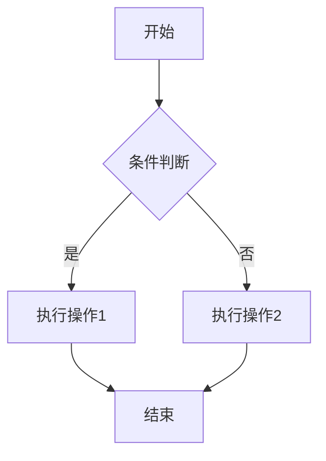
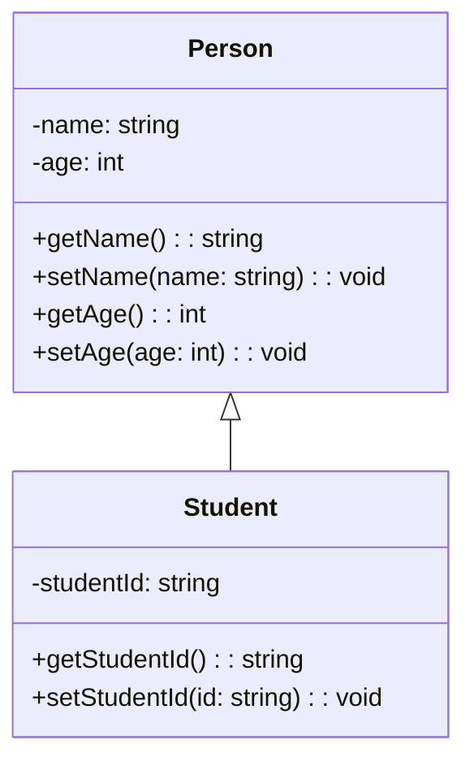
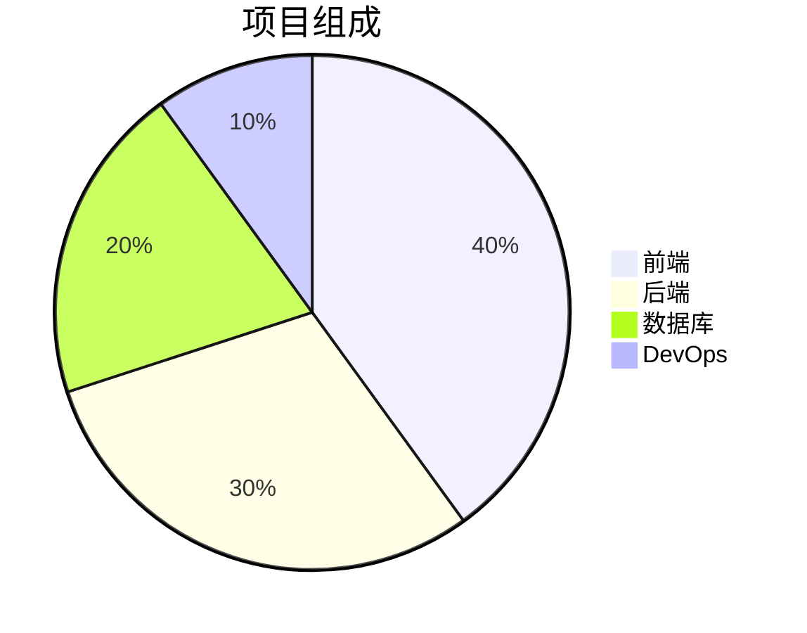

# Mermaid 测试页面

## 流程图示例

```mermaid
flowchart TD
    A[开始] --> B{条件判断}
    B -->|是| C[执行操作1]
    B -->|否| D[执行操作2]
    C --> E[结束]
    D --> E
```

## 类图示例

```mermaid
classDiagram
    class Person {
        -name: string
        -age: int
        +getName(): string
        +setName(name: string): void
        +getAge(): int
        +setAge(age: int): void
    }
    
    class Student {
        -studentId: string
        +getStudentId(): string
        +setStudentId(id: string): void
    }
    
    Person <|-- Student
```

## 饼图示例

```mermaid
pie
    title 项目组成
    "前端" : 40
    "后端" : 30
    "数据库" : 20
    "DevOps" : 10
```